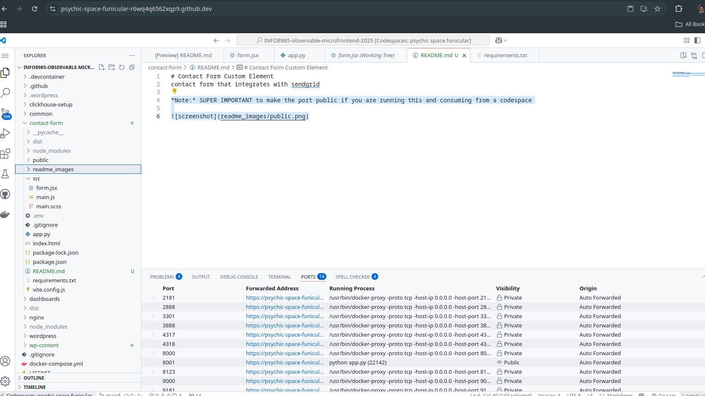

# INFO8985-observable-microfrontend
Observable Wordpress with a contact form microfrontend

*Note:* SUPER IMPORTANT to make the custom element port public if you are running this and consuming from a codespace



```bash
docker compose up -d
```

This brings up signoz on port 3301 in a codespace. It also brings up wordpress on port 8000. Wordpress is instrumented to work with otel.

I also used this for a demo I was doing. To do this, I added an nginx proxy in the nginx folder and added the container with `- ./nginx/docker-compose.yml` in the `docker-compose.yml` file.

## Assignment

Even a pamphlet wordpress site needs a method to contact the business. This assignment is to make a wordpress site with a microfrontend contact form based on [this github](https://github.com/rhildred/contact-form). You will also use [this repository](https://github.com/conestogac-acsit/cdevops-microfrontend) to include your contact form microfrontend custom element. Take a close look at `toster.sh`, `app.py` and the `src` folder.

## Marking

This is a group project.

|Item|Out Of|
|--|--:|
|get wordpress up and running from the wp-content folder|2|
|get the contact form up and running from [the github](https://github.com/rhildred/contact-form) in your contact-form folder|2|
|use [this repository](https://github.com/conestogac-acsit/cdevops-microfrontend) to instrument your contact form|2|
|find and screenshot the error in signoz when the contact service doesn't have credentials for sendgrid|2|
|signup for sendgrid, get credentials, send someone on the team an email from the contact form and print as a pdf|2|
|||
|total|10|

Hand in a .zip of your repository, including the screen shot of the credential error in signoz and the printed .pdf of your email from the contact form.
